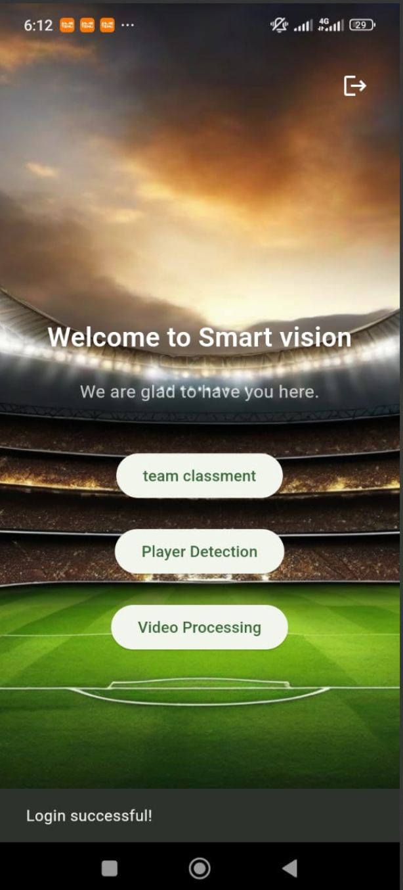

# ⚽ GoalLens - Phase 1: Multiplatform Flutter App

GoalLens is a Flutter-based application designed to bring AI-driven solutions to enhance user interaction and data analysis. The project integrates cutting-edge technologies to provide a seamless experience across multiple functionalities, including chatbot interaction, real-time data scraping, and video processing.

---


## 🎯 Features 

### 1. Team_Classement Real-Time Data Scraper 🌐

- **Overview:** GoalLens includes a team_classement feature that scrapes and processes real-time data.
- **Functionality:**
  - 📡 Gathers the latest data from an API.
  - 📊 Ensures up-to-date information for decision-making.
  - ⚡ Optimized for speed and reliability.

### 2. Video Processing via Flask API 🎥 (ON HOLD)

- **Overview:** The app enables users to select videos from their gallery for processing via an external API.
- **Technical Details:**
  - 🐍 The video processing backend is built with Flask and Python.
  - 🔗 Utilizes an API to connect the Flutter frontend to the backend.
  - ✨ Processes and returns insights or transformed video content.

### 3. Chatbot Powered by Ollama Llama 3 🤖

- **Overview:** The application features a chatbot powered by Ollama Llama 3, offering intelligent and context-aware interactions.
- **Capabilities:**
  - 💬 Handles user queries efficiently.
  - 🧠 Provides personalized responses.
  - 🔄 Built for adaptability across multiple use cases.

### 4. Firebase Integration 🔥

- **Authentication:**
  - 🔐 Secure user authentication via Firebase Authentication.
  - 🌐 Supports email/password and social logins.
- **User Registration:**
  - 🛠️ Streamlined user registration.
  - 🔄 Real-time updates and data sync using Firebase Realtime Database.

---

## 🛠️ Technology Stack 

### Frontend:

- **Framework:** Flutter 🐦
- **Language:** Dart 💻

### Backend:

- **Chatbot:** Ollama Llama 3 🤖
- **Video Processing:** Flask + Python 🐍
- **Real-Time Data Scraping:** Dart 🌐

### Cloud Services:

- **Authentication & Realtime Database:** Firebase 🔥

---

## ⚙️ Installation 

### Prerequisites:

1. Flutter SDK installed ([Get Started with Flutter](https://flutter.dev/docs/get-started)).
2. Python environment set up for Flask.
3. Firebase project set up and configured.

### Steps:

1. Clone the repository:
   ```bash
   git clone https://github.com/your-username/GoalLens.git
   cd GoalLens
   ```
2. Install dependencies:
   ```bash
   flutter pub get
   ```
3. Set up Firebase:
   - Add your `google-services.json` (for Android) and `GoogleService-Info.plist` (for iOS) to the respective directories.
4. Run the Flask backend:
   ```bash
   cd backend
   python app.py
   ```
5. Run the Flutter app:
   ```bash
   flutter run
   ```

---

## 🌐 API Endpoints 

### Flask Backend:

- **Video Processing Endpoint:**
  - `POST /process-video`
  - **Request:** Video file in form-data.
  - **Response:** Processed video or insights in JSON.

---

## 📱 Usage 

1. 🚀 Launch the app and sign in/register using Firebase Authentication.
2. 🤖 Interact with the chatbot for assistance or insights.
3. 🌐 Use the team_clament feature to access real-time scraped data.
4. 🎥 Upload a video for processing and view the results seamlessly in the app.

---

## 📜 License

This project is licensed under the MIT License. Feel free to use and modify it for your own projects.

## 🙌 Contributing

Contributions are welcome! Please feel free to submit a pull request or open an issue.

## 📧 Contact

If you have any questions or need further assistance, feel free to reach out:

- **Email:** boujirimane1@gmail.com
- **GitHub:** https://github.com/Imane-Bjr